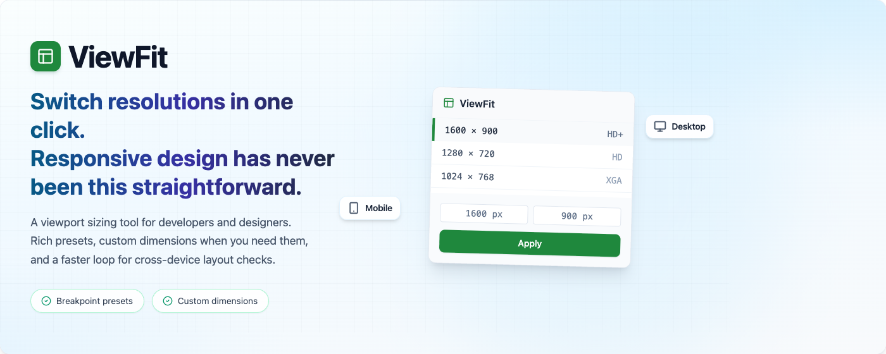

**English** | [简体中文](README.zh-CN.md)

# ViewFit Extension

> **Switch resolutions in one click.**  
> **Responsive design has never been this straightforward.**

A viewport sizing tool for developers and designers. Rich presets, custom dimensions when you need them, and a faster loop for cross-device layout checks.

Under the hood, ViewFit is a Chrome/Edge (MV3) extension: it resizes the current browser window toward your target viewport size and runs calibration to get closer to the requested result.



## Features

- Built-in preset library for mobile/tablet/desktop sizes
- Custom presets (save/remove) with local persistence
- Background resize workflow (Service Worker) so resize can continue even if popup closes
- Automatic window state normalization (restores fullscreen/maximized windows before resizing)
- Calibrated mode with iterative viewport correction
- Fallback mode when viewport metrics are unavailable on the current page

## Architecture (Current)

- `src/popup`: UI, preset management, input validation, and request dispatch
- `src/background`: receives resize requests and executes resize jobs
- `src/content`: returns viewport metrics (`innerWidth/innerHeight`)
- `src/shared`: shared types, presets, and resize core logic

## Development

```bash
pnpm install
pnpm run lint
pnpm run build
```

Useful commands:

- `pnpm run dev` - watch build output
- `pnpm run lint:fix` - auto format and fix lint issues

## Load in Browser

1. Build the project: `pnpm run build`
2. Open `chrome://extensions` (or Edge equivalent)
3. Enable `Developer mode`
4. Click `Load unpacked`
5. Select the `dist` folder

## Fonts

Popup fonts are loaded from:

- `public/fonts/ibm-plex-sans-var.woff2`
- `public/fonts/jetbrains-mono-var.woff2`

You can replace these files with your preferred font binaries.
